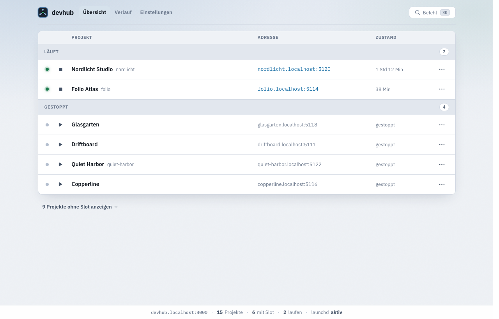

# devhub

**Ein lokaler Hub für alle deine Dev-Server - damit Coding-Agenten und du denselben Server treffen.**

Wenn Cursor, Claude Code oder Codex jeweils `npm run dev` starten, entstehen schnell
zwei Server auf zwei Ports. Logins und Daten „fehlen“, obwohl „alles läuft“.
devhub gibt jedem Projekt **eine feste Adresse** und einen **Dienst unter launchd**,
der die Server überlebt - unabhängig von IDE, Agent-Sitzung oder Terminal.

Übersicht im Browser: [http://devhub.localhost:4000](http://devhub.localhost:4000)



---

## Für wen ist das?

- Du arbeitest auf **macOS** mit mehreren lokalen Projekten.
- Du nutzt **Coding-Agenten** (Cursor, Claude Code, Codex, …), die sonst selbst
  Dev-Server starten würden.
- Du willst stabile URLs wie `http://mein-projekt.localhost:5120` statt
  „diesmal 3000, nächstes Mal 3001“.

**Nicht nötig**, wenn du nur ein Projekt hast und nie parallel Agent + Mensch
am selben Stack arbeitest.

---

## Voraussetzungen

| Was | Anforderung |
| --- | --- |
| Betriebssystem | **macOS** (launchd) |
| Runtime | **Node.js 20+** |
| Projekte | Ordner unter einer Wurzel (Standard: `~/Dev`) |

Keine npm-Abhängigkeiten: nur die Node-Standardbibliothek.

---

## Schnellstart

```bash
git clone https://github.com/Pikktee/devhub.git
cd devhub
node bin/dev.js setup
```

`setup` erledigt:

1. Prüft macOS und Node-Version  
2. Klärt die **Projektwurzel** (siehe unten)  
3. `npm link` → Befehle `devhub` und `dev` im PATH  
4. Installiert den **launchd-Dienst** (Hub startet nach Anmeldung von selbst)  
5. Schreibt globale **Agent-Regeln** (`sync --global`)  
6. Installiert den **Cursor-Skill** nach `~/.cursor/skills/devhub/`

Danach Projekte aufnehmen und starten:

```bash
devhub list
devhub adopt mein-projekt          # vergibt festen Slot / Port
devhub sync                        # lokale Agent-Dateien (Ports) im Projekt
devhub up mein-projekt
devhub status mein-projekt
open http://devhub.localhost:4000
```

`dev` ist nur die Kurzform von `devhub` - inhaltlich dasselbe.

### Projektwurzel wählen

| Aufruf | Verhalten |
| --- | --- |
| `devhub setup` | Nutzt `~/Dev`, falls vorhanden. Fehlt der Ordner, fragt ein Dialog: anlegen, anderen Pfad, oder abbrechen. |
| `devhub setup --wurzel ~/Code` | Diese Wurzel verwenden (ohne Dialog). |
| `devhub setup --wurzel ~/Code,~/Work` | Mehrere Wurzeln. |

Ohne interaktives Terminal (z. B. Skript) und ohne vorhandenes `~/Dev` bricht
Setup ab und verlangt `--wurzel` - es wird nichts stillschweigend angelegt.

---

## Alltag in 30 Sekunden

```bash
devhub status                 # was läuft?
devhub up journey             # starten (idempotent, wenn schon an)
devhub logs journey           # Log lesen
devhub down journey           # ganze Prozessgruppe stoppen
devhub open journey           # Frontend im Browser
```

Der **CLI-Name** ist der Ordner unter der Wurzel (`journey`).
Die **URL** folgt dem Anzeigenamen (`http://maptale.localhost:5120`).
Bei `devhub status <ordner>` stehen Frontend- und Backend-URLs unter Prozesse -
Backends meist als `http://127.0.0.1:…`.

---

## Oberfläche

Die Übersicht unter [http://devhub.localhost:4000](http://devhub.localhost:4000)
zeigt alle erkannten Projekte, Start/Stopp und feste Adressen.

| Bereich | Route | Inhalt |
| --- | --- | --- |
| Übersicht | `/` | Projekte starten/stoppen, öffnen, Logs |
| Verlauf | `/verlauf` | Letzte Aktionen |
| Einstellungen | `/einstellungen` | Wurzeln, Hub-Port, Domain, Editor, Agent-Anzeige (einklappbare Abschnitte) |

- **Befehlspalette:** `⌘K` - Navigation, Projekte und Aktionen (auch Theme umschalten).
- **Hell-/Dunkelmodus:** in den Einstellungen oder über die Palette; Speicherung im Browser (`localStorage`), nicht in der Registry.
- **Design Tokens:** [`DESIGN.md`](DESIGN.md) und [`ui/styles/tokens.css`](ui/styles/tokens.css) - gemeinsame Farben, Radien, Typo.
- **Einstellungen speichern:** Formular unten oder `⌘S`. Port-Änderungen brauchen danach `devhub service install`, damit launchd den neuen Hub-Port lädt.

---

## Wichtige Kommandos

| Kommando | Wirkung |
| --- | --- |
| `devhub setup [--wurzel …]` | Neuen Rechner einrichten |
| `devhub status [projekt]` | Laufzustand, Ports, URLs |
| `devhub up <projekt> [--profil p]` | Abgekoppelt starten |
| `devhub down <projekt>` / `--alle` | Prozessgruppe stoppen |
| `devhub restart <projekt>` | Stoppen und starten |
| `devhub logs <projekt> [-f] [-n 40]` | Server-Ausgabe |
| `devhub ports` | Slot- und Portvergabe anzeigen |
| `devhub list` | Alle erkannten Projekte |
| `devhub adopt <projekt>` | Slot vergeben |
| `devhub forget <projekt>` | Aus der Registry (Slot bleibt gesperrt) |
| `devhub sync [--global]` | lokale Agent-Dateien / globale Regeln schreiben |
| `devhub agents [projekt]` | Regeln / Skills / Memory anzeigen |
| `devhub link [projekt]` | `AGENTS.md` ↔ `CLAUDE.md` verknüpfen |
| `devhub doctor` | Kollisionen und Ungereimtheiten |
| `devhub serve [--port …]` | Hub im Vordergrund (ohne launchd) |
| `devhub service install\|uninstall` | launchd-Dienst (ohne Argument: Status) |
| `devhub open [projekt]` | Browser (oder `--finder` / `--ordner`) |
| `devhub reveal <projekt>` | Projektordner im Finder |

Ohne Projektnamen gilt das Verzeichnis, in dem du stehst.
`dev` ist Alias für `devhub`.

---

## Ports und Adressen

Jedes aufgenommene Projekt bekommt einen **Slot** (10–99). Der Slot wird
**nie wiederverwendet** - alte Bookmarks zeigen nicht plötzlich auf ein fremdes Projekt.

| Rolle | Formel | Beispiel Slot 20 |
| --- | --- | --- |
| Frontend | `51NN` | 5120 |
| Backend | `87NN` | 8720 |

Adresse Frontend: `http://<anzeigename>.localhost:<port>`  
Zweites Profil (z. B. smoke): `http://<name>-smoke.localhost:<port>`

macOS löst `*.localhost` ohne `/etc/hosts` und ohne Root auf. Der Port bleibt in
der URL, damit HMR (Vite u. a.) funktioniert. Getrennte Hostnamen bedeuten auch
getrennte Cookies - zwei Instanzen desselben Projekts überschreiben sich nicht
mehr die Anmeldung.

---

## Coding-Agenten

Agents sollen **keine** eigenen Dev-Server starten (`npm run dev`, `vite`,
`next dev`, `uvicorn`, …). Stattdessen: `devhub status` / `devhub up` / `devhub down`.

### Was `devhub sync` schreibt

Nur **lokale** Dateien im Projekt (nicht fürs Repo gedacht) plus einen
gitignore-Marker. Die allgemeine „keine eigenen Dev-Server“-Regel liegt
global auf der Maschine (`sync --global`), nicht in jedem Projekt-Repo.

| Datei | Ins Git? | Inhalt |
| --- | --- | --- |
| `.cursor/rules/devhub.local.mdc` | nein | Ports dieser Maschine |
| `.claude/launch.json` | nein | Nur Attach-URLs, keine Startkommandos |
| `.gitignore` (Marker `# >>> devhub`) | ja | Lokale Hub-Dateien ausnehmen |

`devhub sync --global` schreibt die allgemeine Regel nach
`~/.claude/CLAUDE.md`, `~/.cursor/rules/devhub.mdc` und `~/.codex/AGENTS.md`.

Optional `--hook`: Claude-PreToolUse fängt typische Dev-Server-Starts ab.

### Cursor-Skill

Nach `setup` liegt der Skill unter `~/.cursor/skills/devhub/`. Vorlage im Repo:
[`skill/cursor/SKILL.md`](skill/cursor/SKILL.md).

---

## Projekte konfigurieren

**Viele Node-Projekte brauchen nichts Extra.** Der Hub liest `package.json`,
findet das Dev-Skript und übergibt Port über `--port` / `PORT`. Auch Unterordner
wie `web/`, `app/`, `landing/` werden erkannt. Frontend+API (z. B. `server/` oder
Python unter `web/` + `uv`) können abgeleitet werden.

Wenn der Hub „kein Server“ meldet, oft korrekt (Notizen, Native-Apps, Sammelordner).
Unterordner einzeln aufnehmen: `devhub adopt monorepo/app`.

### Optional: `devhub.json`

Wenn die Ableitung nicht passt (Compose, uvicorn-Modulpfad, Sonderfälle):

```json
{
  "profiles": {
    "default": [
      {
        "name": "web",
        "role": "frontend",
        "cmd": ["npm", "run", "dev", "--", "--port", "{port}", "--strictPort"]
      },
      {
        "name": "api",
        "role": "backend",
        "cwd": "server",
        "env": { "PORT": "{port}" },
        "cmd": ["npm", "run", "dev"]
      }
    ]
  }
}
```

Platzhalter: `{port}`, `{host}`, `{url}`, `{project}`, `{profile}`, `{path}`  
(deutsche Schlüsselnamen werden ebenso akzeptiert.)

Python mit `app.py` / `main.py` / `server.py` (Flask o. Ä., `PORT` aus der Umgebung)
wird ohne `devhub.json` abgeleitet - bei vorhandenem `.venv` mit dessen Interpreter.
Für Modulstarts wie uvicorn braucht es weiter eine Datei:

```json
{
  "profiles": {
    "default": [
      {
        "name": "api",
        "role": "backend",
        "cmd": [".venv/bin/uvicorn", "app:app", "--port", "{port}"]
      }
    ]
  }
}
```

---

## Was der Hub durchsetzt

- Server starten **abgekoppelt** (eigene Prozessgruppe) - überleben Shell und IDE.
- Stoppen der **ganzen Gruppe**, nicht nur eines PIDs.
- Status aus **Port-Probe**, nicht aus einer PID-Datei.
- Port muss vor dem Start frei sein; weicht der Server aus (Next.js), stoppt der Hub und meldet es.
- `devhub up` auf etwas Laufendem ist ein No-op.

---

## Dateien auf dem Rechner

| Was | Wo |
| --- | --- |
| Registry (Slots, Anzeigenamen, Einstellungen) | `~/.config/devhub/registry.json` |
| Laufzustand | `~/.local/state/devhub/state.json` |
| Logs | `~/.local/state/devhub/logs/` |
| launchd | `~/Library/LaunchAgents/dev.local.devhub.plist` |

In `registry.json` unter `settings` u. a.:

| Schlüssel | Bedeutung | Standard |
| --- | --- | --- |
| `roots` | Projekt-Wurzelverzeichnisse | `~/Dev` (absolut) |
| `hubPort` | Port der Hub-Oberfläche | `4000` |
| `domainSuffix` | Domain für Projekt-URLs | `localhost` |
| `editor` | Kommando für „Im Editor öffnen“ | `cursor` |
| `readyTimeoutMs` | Wartezeit auf Server-Port | `60000` |
| `showGlobalAgentContext` | Globale Agent-Dateien in der UI | `true` |

Diese Pfade gehören **nicht** ins Git deiner Anwendungsprojekte. Das Theme der
Oberfläche liegt nur im Browser, nicht in der Registry.

---

## Wieder entfernen

```bash
devhub down --alle
devhub service uninstall
npm unlink -g devhub          # falls per setup / npm link installiert
# ggf. auch: npm unlink -g dev
```

Optional aufräumen:

| Was | Pfad / Aktion |
| --- | --- |
| Cursor-Skill | `rm -rf ~/.cursor/skills/devhub` |
| Globale Agent-Regeln | Block zwischen den `devhub`-Ankern in `~/.claude/CLAUDE.md`, `~/.cursor/rules/devhub.mdc`, `~/.codex/AGENTS.md` (oder die Dateien löschen, falls sie nur Hub-Inhalt hatten) |
| Registry & State | `rm -rf ~/.config/devhub ~/.local/state/devhub` |
| Projekt-Verträge | Lokale `.cursor/rules/devhub.local.mdc` / `.claude/launch.json` - oder pro Projekt `devhub forget <ordner>` (entfernt Hub-Dateien, behält den Slot gesperrt). Alte `AGENTS.md`-Blöcke von früheren Syncs räumt Forget ebenfalls auf. |

Das geklonte Repo-Verzeichnis kannst du danach einfach löschen. Ohne `service uninstall` würde launchd den Hub nach dem Löschen des Ordners weiter starten wollen und scheitern.

---

## Entwickeln am Hub selbst

```bash
npm test
npm run serve:dev    # Hub auf Port 4001, eigenes Zustandsverzeichnis
```

Nicht die produktive Instanz auf 4000 zum Experimentieren nutzen - sonst
verwirren sich PID-Dateien der echten Projekt-Server.

Hintergrund und Designentscheidungen stecken in den Modulen unter `src/`
sowie in [AGENTS.md](AGENTS.md) (Hinweise für Agents in diesem Repo).

---

## FAQ

### Wie deinstalliere ich devhub wieder?

Siehe [Wieder entfernen](#wieder-entfernen): zuerst Server und launchd stoppen,
dann optional Link, Skill, Regeln und Zustandsordner löschen.

### Warum nicht einfach immer `npm run dev`?

Weil der nächste Agent (oder du in einem zweiten Terminal) dasselbe nochmal
startet. Ohne festen Port weichen Vite/Next oft aus - dann reden Frontend und
Mensch von verschiedenen Welten. Der Hub hält **eine** Instanz auf **einer** Nummer.

### Schreibt sync noch in meine AGENTS.md?

Nein. Sync schreibt nur lokale, gitignorierte Dateien plus den gitignore-Marker.
Einen älteren Hub-Block in `AGENTS.md` entfernt `devhub forget` bzw. unsync.

### Funktioniert das unter Linux oder Windows?

Derzeit **nein**. Der Dauerbetrieb hängt an **launchd** (macOS). Beiträge für
systemd o. Ä. wären willkommen, sind aber noch nicht gebaut.

### Muss jedes Projekt `devhub.json` haben?

Nein. Node mit üblichem Dev-Skript und einfaches Python (`app.py`/`main.py` mit
`PORT`) meist automatisch. `devhub.json` für Compose, uvicorn-Modulpfade und
Sonderfälle. (Ältere `dev.json` wird noch gelesen.)

### Kann ich die Registry / Ports von einem Mac auf den anderen kopieren?

Technisch die `registry.json` - sinnvoller ist oft ein frisches `adopt` auf dem
neuen Rechner. Slots sind lokal; URLs können abweichen. `setup` legt ohnehin
eine eigene Registry an.

### Der Hub antwortet nicht auf Port 4000

```bash
devhub service status
devhub doctor
devhub service install    # erneut laden
```

Nach einem Update des Repos oft einmal `service install`, damit launchd die
aktuelle `bin/dev.js` nutzt.

### Ich hatte früher `net.henrikheil.devhub`

Der Dienst heißt jetzt `dev.local.devhub`. Alte plist entfernen und neu
installieren:

```bash
launchctl bootout gui/$(id -u)/net.henrikheil.devhub 2>/dev/null
rm -f ~/Library/LaunchAgents/net.henrikheil.devhub.plist
devhub service install
```

### Sind Secrets im Hub sicher?

Der Hub lauscht nur auf **127.0.0.1**. Die Agent-Vorschau liefert nur zuvor
erkannte Kontextdateien, keinen freien Dateizugriff. Trotzdem: keine Secrets in
Dateien legen, die du Agenten ohnehin nicht zeigen willst.

### `npm link` ohne Admin-Rechte?

Dann ohne Link arbeiten: `node /pfad/zu/devhub/bin/dev.js …` - oder ein Alias in
der Shell setzen. `setup` meldet, wenn `npm link` scheitert.

---

## Mitwirken

Issues und Pull Requests sind willkommen. Bitte:

- `npm test` grün halten  
- keine Runtime-npm-Abhängigkeiten hinzufügen  
- CLI- und UI-Texte auf **Deutsch**, Bezeichner im Code auf **Englisch**

---

## Lizenz

[MIT](LICENSE)
